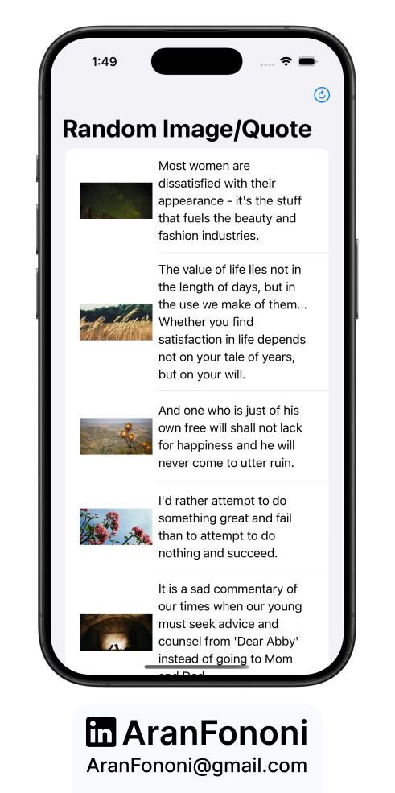

# Async Random Image & Quote App 🎲🖼️  

### Learning Swift Concurrency with Async/Await & Task Groups  

This is my final project from the iOS Concurrency course, but I didn’t stop there. I went beyond the basics, improved performance using **Task Groups**, and revisited **async/await, structured concurrency, and MVVM**.  

## 📌 Project Overview  
This app fetches **random images and quotes** in real-time using APIs. The goal was to make API calls fully asynchronous while keeping the UI smooth and responsive.  

⚠️ **Important:** To run this project, replace `"YOURAPIKEY"` in `Constants.swift` with your own API key from [API Ninjas](https://api-ninjas.com).  

## 🚀 What I Focused On  
- **Swift Concurrency:** Used async/await and Task Groups for better performance.  
- **MVVM Architecture:** Improved code structure by separating logic from UI.  
- **SwiftUI:** Built a simple but scalable interface.  
- **Networking:** Made API calls more efficient with error handling.  

## 🔥 Features  
✅ Fetches random images asynchronously using `picsum.photos` API  
✅ Retrieves quotes in real-time from `api-ninjas.com`  
✅ Fully async networking with `URLSession`  
✅ Pull-to-refresh functionality  

---

## 📸 Screenshot  
  

---

## 🛠️ How to Use  
1. Clone this repository.  
2. Open `Constants.swift` and **replace `"YOURAPIKEY"`** with your API key from [API Ninjas](https://api-ninjas.com).  
3. Run the project in Xcode (iOS 16+ recommended).  

---

## 📬 Contact  
For any questions or collaborations, feel free to reach out:  
- **Email**: [aranfononi@gmail.com](mailto:aranfononi@gmail.com)  
